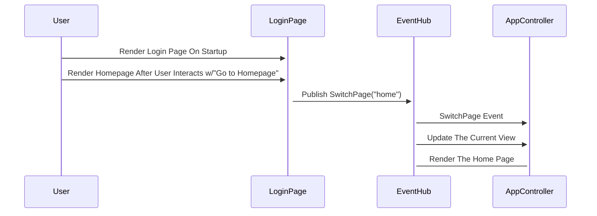

## Description:

The Login Page, once backend logic is implemented, is intended for users to be able to login via their spotify accounts. The Login Page is implemented in LoginPage.js, but uses events (observer) to signal the app controller to switch views. The LoginPage is the default view and utilizes a link to the HomePage to allow for easy traversal. 

## Diagram

