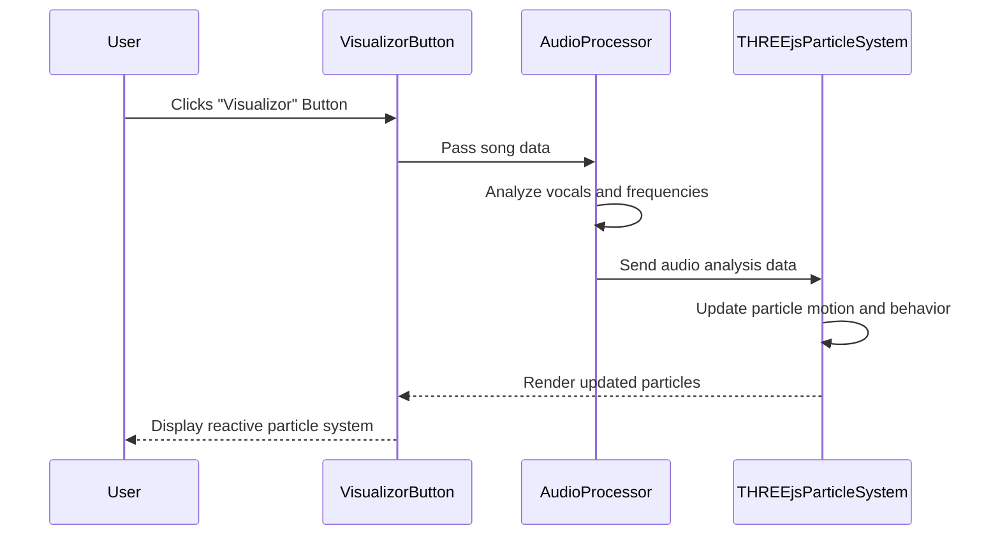

## Description:

The sequence begins with the User clicking the VisualizorButton, which passes the selected song to the AudioProcessor. The AudioProcessor analyzes the song’s frequencies and vocals, sending the data to the THREEjsParticleSystem. The particle system dynamically updates its visuals (motion, color, and behavior) based on the audio analysis and renders the reactive visualizer, which is displayed back to the User.

## Diagram

