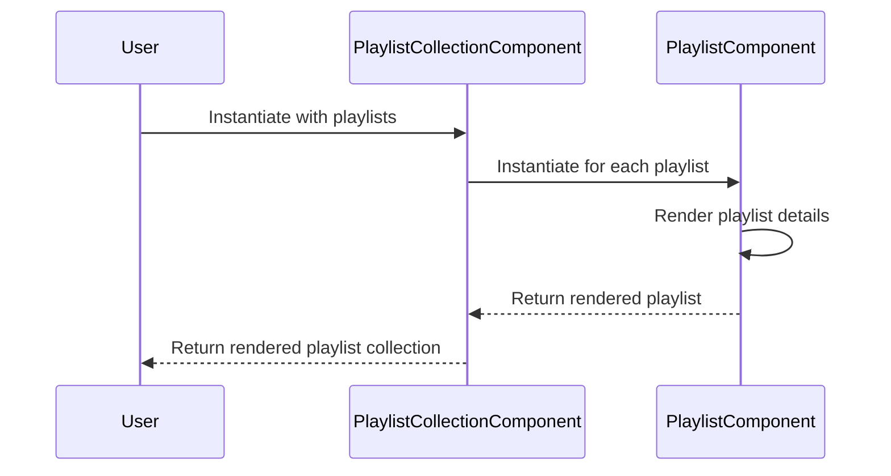

## Description:

This sequence diagram shows how a user interacts with the PlaylistCollectionComponent and PlaylistComponent to display a collection of playlists. The PlaylistCollectionComponent creates individual PlaylistComponent instances for each playlist, which render their details and return them. The final rendered playlist collection is then returned to the user.
## Diagram

