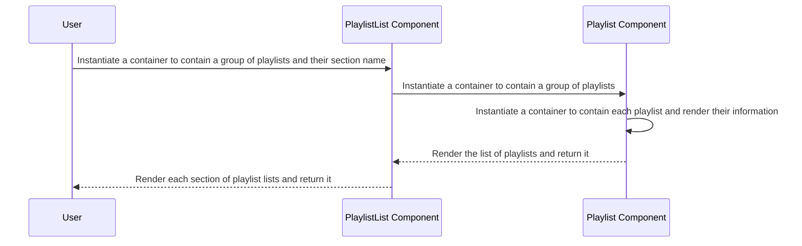

## Description:

The PlaylistList diagram shows how a user interacts with the PlaylistList and Playlist Components to view and interact with a collection of playlists. The PlaylistList Component contains several Playlist Components, each representing a playlist, which renders each playlist container. Then, each Playlist Component is rendered, containing an icon and information about the playlist, and they are returned to the user.

## Diagram

