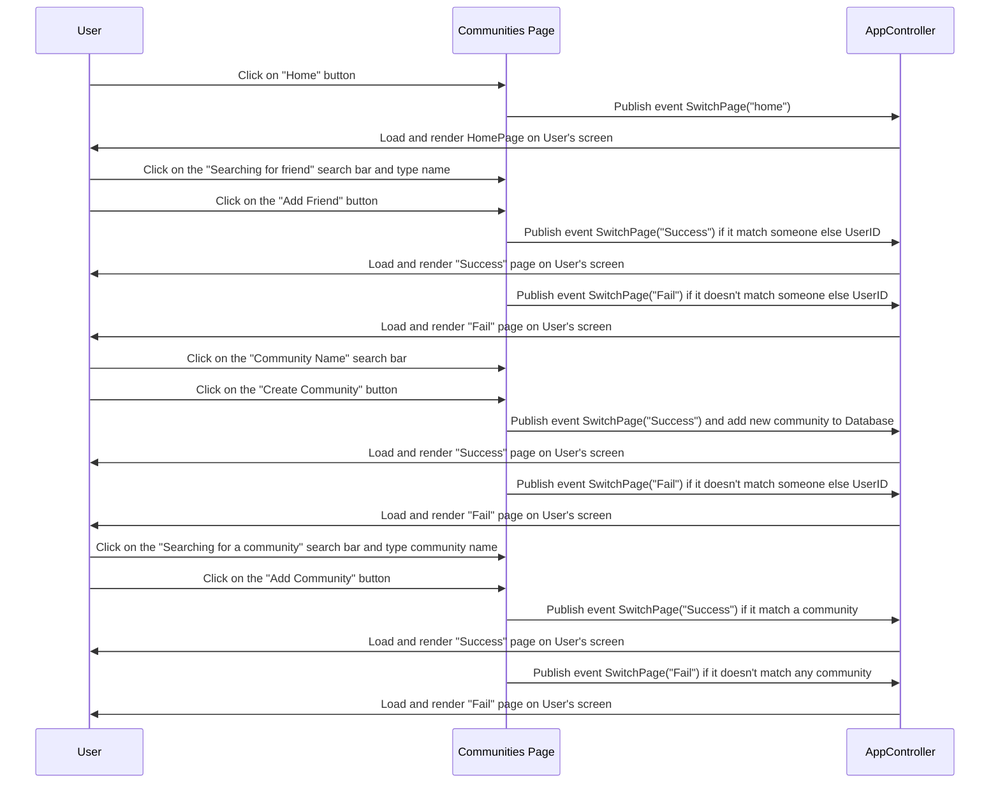

# Communities Page Sequence Diagram

## Description:

The user can search for friends, and join/create Communities by name on the search bar for each section. After that "Success" page or "Fail" page will appear based on searching result. Otherwise, they can click on the "Home" button to return to the home page.

## Diagram

