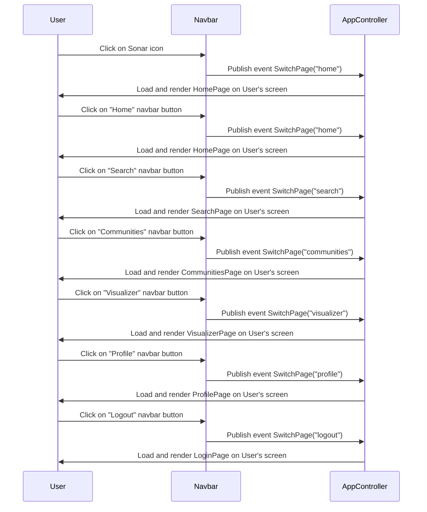

# Navbar Sequence Diagram

## Description:

The user can use the navigation bar on the left side of the screen to change between different views: Home, Tags, Communities, Profile, Login/Logout, potentially Search. The navbar is implemented in Navbar.js, but uses events (observer) to signal the app controller to switch views.

## Diagram

